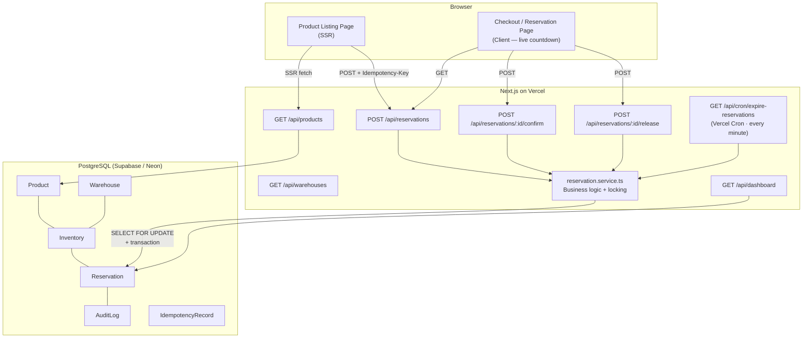

# Allo Inventory Reservation System

A production-grade inventory reservation system for the Allo Health engineering take-home. Solves the checkout race condition: multiple customers competing for the last unit of a SKU during a multi-step payment flow.

[](https://www.typescriptlang.org/)
[]()
[]()

---

## Architecture



---

## Database Schema

```
Product           id · name · sku · description · imageUrl
Warehouse         id · name · location
Inventory         id · productId · warehouseId · quantity · reserved
Reservation       id · inventoryId · quantity · status · expiresAt · idempotencyKey
AuditLog          id · reservationId · event · metadata · createdAt
IdempotencyRecord key · response · statusCode · expiresAt
```

### Design decision: dual-counter availability

`Inventory` stores two numbers:
- **`quantity`** — total physical units on the shelf
- **`reserved`** — units currently held by `PENDING` reservations

`available = quantity − reserved` is derived at query time. When a reservation is **confirmed**, both decrease (`quantity−−, reserved−−`). When it is **released or expired**, only `reserved` decreases. This means the product listing page computes availability from a single indexed column read — no aggregate over reservation rows needed.

### Index decisions

| Index | Purpose |
|---|---|
| `Inventory(productId, warehouseId) UNIQUE` | Primary lock target for `FOR UPDATE`; enforces one row per SKU/warehouse |
| `Inventory(productId)` | Product listing page — fetch all warehouses for a product |
| `Reservation(status, expiresAt)` | Cron sweep: `WHERE status='PENDING' AND expiresAt < NOW()` — O(expired) not O(all) |
| `Reservation(inventoryId, status)` | Availability aggregation |
| `Reservation(idempotencyKey) UNIQUE` | Fast dedup lookup; uniqueness prevents duplicate rows under race |
| `AuditLog(reservationId)` | Timeline query per reservation |
| `IdempotencyRecord(expiresAt)` | TTL-based cleanup |

---

## Concurrency Strategy

### The race condition

```
Time →   T1                        T2
         SELECT available = 1      SELECT available = 1  ← both read 1
         (proceed)                 (proceed)             ← both think they can reserve
         INSERT reservation        INSERT reservation    ← oversell!
```

### Solution: PostgreSQL `SELECT FOR UPDATE`

Every `createReservation` call opens a **Serializable** transaction and immediately acquires an exclusive row lock on the target `Inventory` record:

```sql
BEGIN ISOLATION LEVEL SERIALIZABLE;

  SELECT id, quantity, reserved
  FROM   "Inventory"
  WHERE  "productId"   = $1
    AND  "warehouseId" = $2
  FOR UPDATE;            -- T2 blocks here until T1 commits

  -- available check happens INSIDE the lock (guaranteed fresh value)
  UPDATE "Inventory"
  SET    reserved = reserved + $qty
  WHERE  id = $id;

  INSERT INTO "Reservation" (...);

COMMIT;                  -- T2 unblocks; reads updated reserved; sees 0 → 409
```

When T2 unblocks after T1 commits, it re-reads `reserved` from disk — not a pre-lock snapshot. If T1 consumed the last unit, T2 sees `available = 0` and throws `InsufficientStockError` → **HTTP 409**.

**Why raw SQL for the lock?** Drizzle's query builder doesn't expose `FOR UPDATE`. We use `db.execute(sql\`...\`)` for this single statement only; all other queries use the type-safe ORM layer.

**Why Serializable isolation?** Read Committed + `FOR UPDATE` is sufficient to prevent overselling. Serializable adds protection against predicate-based phantom reads at negligible cost on Postgres's SSI implementation.

**Guarantee:** `reserved` never exceeds `quantity`. No overselling. Ever.

---

## Reservation Lifecycle

```
             createReservation()
         ┌─────────────────────────────────┐
         │  SELECT FOR UPDATE              │
         │  Check available ≥ qty          │
         │  reserved += qty                │
         │  INSERT Reservation (PENDING)   │
         └───────────────┬─────────────────┘
                         │
                    status: PENDING
                         │
          ┌──────────────┼─────────────────┐
          │              │                 │
    confirm()        release()        expiresAt < now
    (payment ok)   (cancel/fail)    (cron or lazy read)
          │              │                 │
      CONFIRMED      RELEASED          EXPIRED
   qty--, res--      res--              res--
```

### Expiry — dual-mode

1. **Vercel Cron** (`/api/cron/expire-reservations`) runs every minute. Finds all `PENDING` rows where `expiresAt < NOW()`, marks them `EXPIRED`, and releases inventory holds in a single bulk `UPDATE` per affected inventory row.
2. **Lazy expiry** on `GET /api/reservations/:id` — if the reservation is still `PENDING` but the wall clock has passed, it is expired inline before the response is returned. Ensures the checkout page always shows the correct terminal state even if the cron is delayed.

---

## Idempotency

Endpoints: `POST /api/reservations`, `POST /api/reservations/:id/confirm`

**Flow:**
1. Client generates a UUID and sends `Idempotency-Key: <uuid>`.
2. Before any business logic, we query `IdempotencyRecord` for that key.
3. **Cache hit** → return the original reservation, no inventory touched.
4. **Cache miss** → execute the operation, then write an `IdempotencyRecord` *inside the same transaction* — so the record and the mutation commit atomically. If the transaction rolls back, the idempotency record rolls back too; the client can safely retry.
5. Records expire after 24 hours.

---

## API Reference

All responses use a consistent envelope:

```json
{ "data": { ... } }          // success
{ "error": "CODE", "message": "..." }  // failure
```

| Method | Path | Description |
|---|---|---|
| `GET` | `/api/products` | All products with available stock per warehouse |
| `GET` | `/api/warehouses` | All warehouses |
| `POST` | `/api/reservations` | Reserve units. `409` if insufficient stock. |
| `POST` | `/api/reservations/:id/confirm` | Confirm (payment succeeded). `410` if expired. |
| `POST` | `/api/reservations/:id/release` | Release (cancel / payment failed). |
| `GET` | `/api/reservations/:id` | Fetch reservation detail + audit timeline. |
| `GET` | `/api/dashboard` | Aggregate metrics. |
| `GET` | `/api/cron/expire-reservations` | Cron sweep (requires `Authorization: Bearer $CRON_SECRET`). |

**Error codes:**

| HTTP | Code | Meaning |
|---|---|---|
| 400 | `INVALID_REQUEST` | Zod validation failed |
| 404 | `RESERVATION_NOT_FOUND` | Unknown ID |
| 409 | `INSUFFICIENT_STOCK` | Not enough available units |
| 410 | `RESERVATION_EXPIRED` | Hold timed out before confirm |
| 422 | `RESERVATION_INVALID_STATE` | Wrong status for this action |
| 500 | `INTERNAL_ERROR` | Unexpected server error |

---

## Local Setup

### Prerequisites

- Node.js 20+
- A hosted PostgreSQL instance — **Supabase**, **Neon**, or **Railway** all have free tiers

### Steps

```bash
# 1. Clone & install
git clone https://github.com/<you>/allo-inventory
cd allo-inventory
npm install

# 2. Environment
cp .env.example .env.local
# Fill in DATABASE_URL in .env.local

# 3. Push schema to database
npm run db:push        # development (no migration files)
# OR for production:
npm run db:migrate     # applies drizzle/migrations/*

# 4. Seed demo data
npm run db:seed

# 5. Start dev server
npm run dev
```

Open [http://localhost:3000](http://localhost:3000).

---

## Environment Variables

| Variable | Required | Description |
|---|---|---|
| `DATABASE_URL` | ✅ | Postgres connection string (with `?sslmode=require` for hosted) |
| `CRON_SECRET` | Production | Bearer token Vercel injects when invoking the cron endpoint. Generate: `openssl rand -hex 32` |
| `NEXT_PUBLIC_BASE_URL` | Optional | Base URL for internal API calls from server components (defaults to `http://localhost:3000`) |

---

## Database Commands

```bash
# Push schema changes without migration files (dev / prototyping)
npm run db:push

# Generate SQL migration files
npm run db:generate

# Apply migration files to the database
npm run db:migrate

# Open Drizzle Studio (visual DB browser)
npm run db:studio

# Seed demo data (wipes existing data first)
npm run db:seed
```

---

## Testing

```bash
npm test              # run all tests once
npm run test:watch    # watch mode
npm run test:coverage # with V8 coverage report
```

**16 tests across 4 suites:**

| Suite | Tests |
|---|---|
| `createReservation` | Happy path · insufficient stock (available=0) · requested > available · **concurrent race — exactly one wins** · idempotency cache hit |
| `confirmReservation` | Confirm PENDING · expired by wall clock · status=EXPIRED · not found · already-confirmed idempotency |
| `releaseReservation` | Release PENDING · idempotent re-release · not found · invalid state (CONFIRMED) |
| `expireStaleReservations` | Batch expiry · no-op when nothing stale |

Tests use a fully-mocked Drizzle client — no live database needed. The concurrency race test fires two `createReservation` calls simultaneously via `Promise.allSettled` and asserts exactly one succeeds and one throws `InsufficientStockError`.

---

## Deployment (Vercel + Supabase/Neon)

```bash
# 1. Push to GitHub
git push origin main

# 2. Import project in Vercel dashboard
# 3. Set environment variables:
#      DATABASE_URL   → your Supabase / Neon connection string
#      CRON_SECRET    → openssl rand -hex 32

# 4. Deploy. Vercel reads vercel.json for cron schedule.

# 5. Run migrations on hosted DB (one-time, from local):
DATABASE_URL="<prod-url>" npm run db:migrate
DATABASE_URL="<prod-url>" npm run db:seed
```

The cron job (`vercel.json` → `"schedule": "* * * * *"`) runs every minute automatically on Vercel.

---

## Design Tradeoffs

### Drizzle ORM over Prisma
Drizzle was chosen because it has zero native binary dependencies — the entire ORM is pure TypeScript/JavaScript. Prisma requires downloading a platform-specific query engine binary at `npm install` time, which fails in air-gapped or restricted CI environments. Drizzle's API is equally expressive and its `db.execute(sql\`...\`)` escape hatch handles the `FOR UPDATE` clause cleanly.

### Counter-based availability vs. join-based
`quantity − reserved` is a single column read. The alternative — `SUM` over `Reservation` rows — requires a join and an aggregate for every product listing query. The tradeoff: writes are slightly more complex (must keep counters accurate under concurrent updates), but reads are O(1) per product.

### Serializable isolation vs. Read Committed
Read Committed + `FOR UPDATE` is sufficient to prevent overselling. Serializable adds protection against predicate-based phantom reads at a small throughput cost. For reservation creation — not the hottest path — the extra safety is worthwhile.

### Postgres for idempotency vs. Redis
Redis `SET NX PX` gives sub-millisecond idempotency checks and built-in TTL. Postgres is one fewer dependency and correct: the unique index on `IdempotencyRecord.key` prevents duplicates. Production systems at millions of req/day should prefer Redis.

### Lazy expiry + cron (dual-mode)
Cron-only expiry leaves a window of up to 60 seconds where a reservation is past its expiry time but still shows as PENDING. Lazy expiry on reads closes that gap for the checkout page UX. The cron handles bulk cleanup so available-stock calculations are always fresh even without a concurrent read.

---

## Future Improvements

1. **Real-time stock updates** — Supabase Realtime or SSE so the product list reflects availability changes without page reload.
2. **Redis for idempotency** — Lower latency, built-in TTL, removes the idempotency cleanup cron.
3. **Payment webhook integration** — Replace the manual "Confirm" button with a `POST /api/webhooks/payment` listener that confirms on `payment.succeeded` and releases on `payment.failed`.
4. **Multi-region locking** — For multi-region Postgres deployments, `pg_advisory_lock` or Redis Redlock instead of row-level locking on a single primary.
5. **Rate limiting** — Per-IP throttling on `POST /api/reservations` to prevent bot-driven stock depletion.
6. **Observability** — OpenTelemetry traces around the reservation transaction, Grafana dashboard for reservation conversion rate and expiry rate.
7. **Quantity limits** — Prevent a single customer reserving all remaining stock of a SKU.
8. **Optimistic locking fallback** — For read-heavy, write-rare scenarios, optimistic locking with a `version` column can reduce lock contention compared to `FOR UPDATE`.

---

## Why This Scales

- **`FOR UPDATE` lock is held for microseconds** (just the transaction duration). Lock contention only occurs when two requests genuinely compete for the last unit — exactly when serialisation is correct.
- **Counter-based availability** means the product listing page is a single indexed read. Scales to arbitrary read replicas with no code changes.
- **Stateless API routes** on Vercel Functions auto-scale horizontally; all shared state lives in Postgres.
- **Idempotency records** enable safe client retries, making the system resilient to network failures without client-side orchestration.
- **Audit logs** write inside the existing transaction — zero extra round trips, complete history for free.
